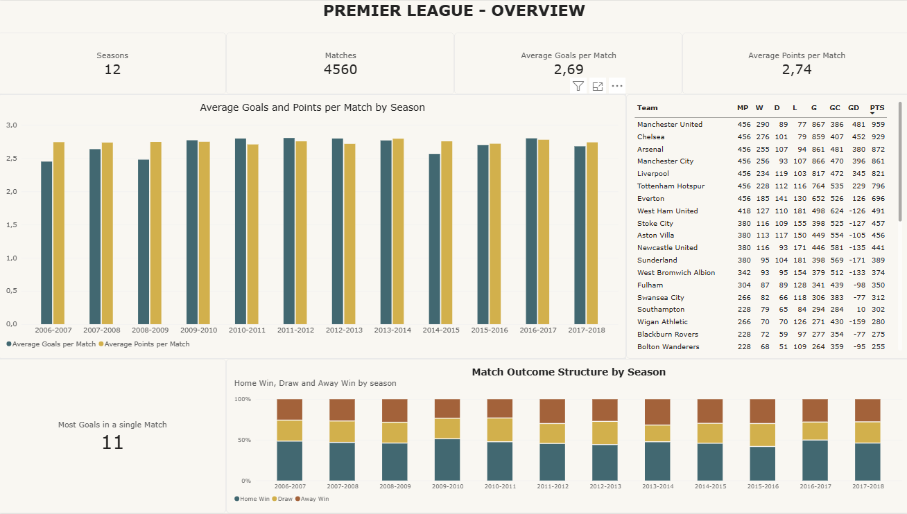
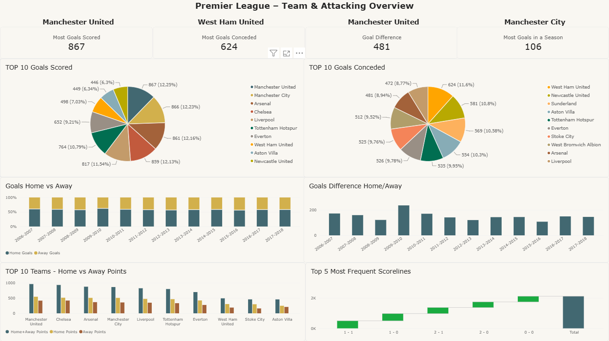
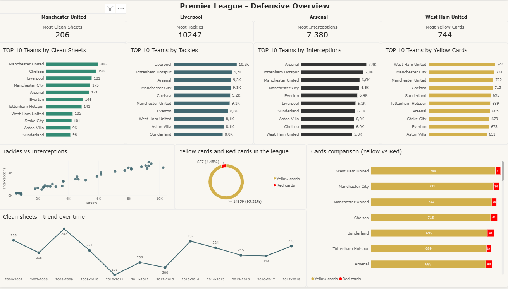
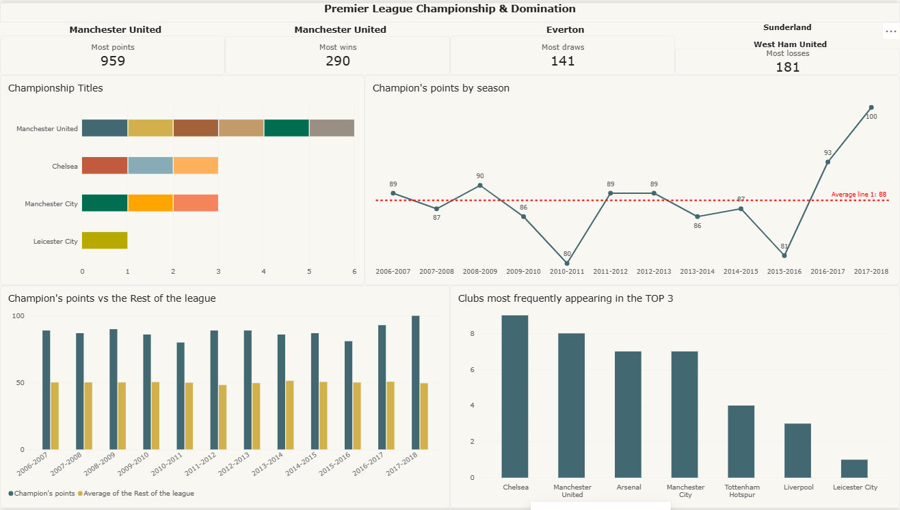

# Premier-League-Analysis
Premier League analysis using SQL and Power BI
## Project Overview

This project presents an analysis of Premier League match data using **SQL** and **Power BI**.

The goal of the project was to explore team performance, match outcomes, attacking and defensive statistics, and trends across Premier League seasons.

The project combines SQL-based data analysis with interactive Power BI dashboards to transform raw match data into meaningful insights.

## Tools & Technologies

- **PostgreSQL** – data analysis and SQL queries
- **Power BI** – data visualization and dashboard creation
- **DAX** – calculated measures and KPIs
- **GitHub** – project documentation and version control

## Analysis Areas

The analysis covers:

- Team performance and league points
- Championship titles and title-winning points
- Home vs. away performance
- Match outcomes
- Goals scored and conceded
- Goal difference
- Defensive statistics
- Most frequent scorelines
- Top-performing teams
- Performance trends by season

## Power BI Dashboards

The project includes several interactive dashboards focused on different aspects of Premier League performance:

## Power BI Dashboards

### 1. Premier League Overview

General league statistics, including:

- Number of seasons and matches
- Average goals per match
- Average points per match
- Team performance overview
- Match outcome structure by season
- Most goals in a single match

### 2. Team & Attacking Overview

Analysis of attacking performance, including:

- Goals scored
- Goals conceded
- Goal difference
- Home vs. away points
- Home vs. away goals
- Most frequent scorelines

### 3. Defensive Overview

Analysis of defensive performance, including:

- Clean sheets
- Tackles
- Interceptions
- Yellow cards and red cards
- Top-performing teams in defensive statistics

### 4. Championship & Domination

Analysis of league dominance and championship performance, including:

- Most points, wins, draws and losses
- Championship titles by club
- Champion's points by season
- Champion's points vs. the rest of the league
- Clubs most frequently appearing in the Top 3

## SQL Analysis

SQL was used to investigate the underlying match data and answer analytical questions related to:

- Team points
- Match results
- Goals
- Home and away performance
- Championship results
- Top-performing teams
- Most frequent scorelines
- Defensive statistics

The SQL analysis is divided into two parts:

### Dashboard Analysis

Folders **D1-D4** contain SQL queries directly related to the four Power BI dashboards. Each folder contains the analytical questions and queries used to support the corresponding dashboard.

- **D1** – Premier League Overview
- **D2** – Team & Attacking Overview
- **D3** – Defensive Overview
- **D4** – Championship & Domination

### Additional SQL Practice

The remaining SQL queries contain additional analytical questions and exercises completed during the project to practice SQL skills.

The analysis includes aggregation, filtering, grouping, conditional logic, JOINs, subqueries, CTEs and window functions.

## Key Skills Demonstrated

- SQL data analysis
- PostgreSQL
- Data aggregation and filtering
- Power BI dashboard development
- Data visualization
- Analytical thinking
- Translating business questions into data analysis

## Project Outcome

The project helped develop practical skills in transforming raw football match data into structured analysis and interactive dashboards.
